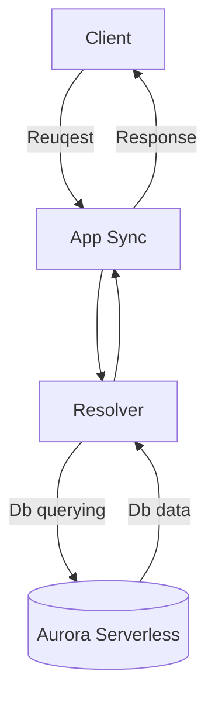

# AppSync Tutorial

# Table of Contents

- [AppSync Tutorial](#appsync-tutorial)
- [Table of contents](#table-of-contents)
  - [Introduction](#introduction)
  - [Techstack](#techstack)
  - [Usage](#usage)
  - [Architecture](#architecture)
  - [Project structure](#project-structure)
- [Code](#code)
  - [Ory/Kratos](#orykratos)
    - [Identity definition](#identity-definition)
    - [Kratos cinfiguration](#kratos-config)
  - [Hasura definition](#hasura-definition)
    - [Webhook](#webhook)
  - [Refine](#refine)
    - [Resources](#resources)
    - [Resoieces file structure](#resource-file-structure)
    - [Refine authencation](#refine-authetication)
- [Conclusion](#conclusion)

## Introduction

In this tutorial we will implement GraphQL Api using AppSync and with Aurora Serverless as data source. It is important to note that our approach excludes creation of ANY backend services, all logic will be implemented inside AppSync.

## Techstack

- [AWS AppSync](https://aws.amazon.com/ru/appsync/) - provides a robust, scalable GraphQL interface for application developers to combine data from multiple sources, including Amazon DynamoDB, AWS RDS, AWS Lambda, and HTTP APIs.
- [AWS Aurora Serverless](https://aws.amazon.com/rds/aurora/serverless/) - is an on-demand, autoscaling configuration for Amazon Aurora. It automatically starts up, shuts down, and scales capacity up or down based on your application's needs. You can run your database on AWS without managing database capacity.
- [Terraform](https://www.terraform.io/) - is an infrastructure as code (IaC) tool that allows you to build, change, and version infrastructure safely and efficiently. This includes both low-level components like compute instances, storage, and networking, as well as high-level components like DNS entries and SaaS features.

## Usage

Download the project
`git clone https://github.com/romanbik/appSyncTutorial.git`

In the root folder run

`terraform init` initializes a working directory containing Terraform configuration files
`terraform plan` shows changes required by the current configuration
`terraform apply` create or update infrastructure

run migration file located in /db onside AWS query editor to create tables

## Architecture



## Project structure

```
AppSync Tutorial
.
|-- ./LICENSE
|-- ./schema.graphql									// GraphQl Schema
|-- ./api												// Velocity Templates for Resolvers
|   `-- ./api/mapping-templates
|       |-- ./api/mapping-templates/default.request.vtl
|       |-- ./api/mapping-templates/default.response.vtl
|       |-- ./api/mapping-templates/project
|       |   |-- ./api/mapping-templates/project/getAll
|       |   |-- ./api/mapping-templates/project/update
|       |   |-- ./api/mapping-templates/project/getById
|       |   |   |-- ./api/mapping-templates/project/getById/project.response.vtl
|       |   |   `-- ./api/mapping-templates/project/getById/project.request.vtl
|       |   |-- ./api/mapping-templates/project/create
|       |   |   `-- ./api/mapping-templates/project/create/createProject.request.vtl
|       |   `-- ./api/mapping-templates/project/delete
|       |       |-- ./api/mapping-templates/project/delete/deleteProject.request.vtl
|       |       `-- ./api/mapping-templates/project/delete/deleteProject.response.vtl
|       `-- ./api/mapping-templates/task
|           |-- ./api/mapping-templates/task/create
|           |-- ./api/mapping-templates/task/delete
|           `-- ./api/mapping-templates/task/getAll
|-- ./util.tf											// terrafrom util resources
|-- ./output.tf
|-- ./resolvers.tf										// resolvers resources
|-- ./aim.tf											// riles and policies
|-- ./db												// database schema
|   `-- ./db/migrations
|       `-- ./db/migrations/schema.sql
|-- ./db.tf												// database resource
|-- ./main.tf											// main tf file
|-- ./variables.tf
|-- ./README.md
`-- ./tree.sh%
```

# Code

## Main (App Sync)

First We need to create main file to bootstrap provisioning. Provide AWS and define AppSync, data sources, api key, GraphQl schema

**Here is resource definition.**
file: `main.tf`

```tf
terraform {
  required_providers {
    aws = {
      source  = "hashicorp/aws"
      version = "~> 4.30"
    }
  }
}

# Set the AWS credentials profile and region you want to publish to.
provider "aws" {
  region                   = var.region
  shared_config_files      = ["~/.aws/config"]
  shared_credentials_files = ["~/.aws/credentials"]
}


# --- AppSync Setup ---

# Create the AppSync GraphQL api.
resource "aws_appsync_graphql_api" "appsync" {
  name                = "${var.prefix}_appsync"
  schema              = file("schema.graphql")
  authentication_type = "API_KEY"
  depends_on          = [aws_rds_cluster.cluster]

}

# Create the API key.
resource "aws_appsync_api_key" "appsync_api_key" {
  api_id = aws_appsync_graphql_api.appsync.id
}

resource "aws_appsync_datasource" "rds" {
  api_id           = aws_appsync_graphql_api.appsync.id
  name             = "rds"
  service_role_arn = aws_iam_role.appsync-role.arn
  type             = "RELATIONAL_DATABASE"
  relational_database_config {
    http_endpoint_config {
      db_cluster_identifier = aws_rds_cluster.cluster.arn
      aws_secret_store_arn  = aws_secretsmanager_secret.db-pass.arn
      database_name         = aws_rds_cluster.cluster.database_name
    }
  }
}
```

## Database (AWS Aurora)

Definig Aurora Cluster resource and secret manage to store user and password for it

**Here is resource definition.**
file: `db.tf`

```tf
locals {
  resource_name_prefix = var.project
}

resource "aws_secretsmanager_secret" "db-pass" {
  name = "${local.resource_name_prefix}-mysql-secret-${random_string.secret_id.result}"
}

resource "aws_secretsmanager_secret_version" "db-pass-val" {
  secret_id = aws_secretsmanager_secret.db-pass.id
  secret_string = jsonencode(
    {
      username      = aws_rds_cluster.cluster.master_username
      password      = aws_rds_cluster.cluster.master_password
      engine        = "mysql"
      host          = aws_rds_cluster.cluster.endpoint
      database_name = "appsync"
    }
  )
}

resource "aws_rds_cluster" "cluster" {
  engine               = "aurora-mysql"
  engine_version       = "5.7.mysql_aurora.2.07.1"
  engine_mode          = "serverless"
  database_name        = "appsync"
  master_username      = "admin"
  master_password      = random_password.db_master_pass.result
  enable_http_endpoint = true
  skip_final_snapshot  = true
  scaling_configuration {
    min_capacity = 1
  }
  lifecycle {
    # RDS auto-upgrades the version
    # so this tells Terraform not to downgrade it the next apply
    ignore_changes = [
      engine_version,
    ]
  }
}
```

## Resolvers

Definig reolvers to handles GraphQl requests

### Terraform file

```tf
# Create resolvers using the velocity templates

resource "aws_appsync_resolver" "createProject_resolver" {
  api_id      = aws_appsync_graphql_api.appsync.id
  type        = "Mutation"
  field       = "createProject"
  data_source = aws_appsync_datasource.rds.name

  request_template  = file("./api/mapping-templates/project/create/createProject.request.vtl")
  response_template = file("./api/mapping-templates/default.response.vtl")
}

resource "aws_appsync_resolver" "delete_resolver" {
  api_id      = aws_appsync_graphql_api.appsync.id
  type        = "Mutation"
  field       = "deleteProject"
  data_source = aws_appsync_datasource.rds.name

  request_template  = file("./api/mapping-templates/project/delete/deleteProject.request.vtl")
  response_template = file("./api/mapping-templates/project/delete/deleteProject.response.vtl")
}

resource "aws_appsync_resolver" "getProject_resolver" {
  api_id      = aws_appsync_graphql_api.appsync.id
  type        = "Query"
  field       = "project"
  data_source = aws_appsync_datasource.rds.name

  request_template  = file("./api/mapping-templates/project/getById/project.request.vtl")
  response_template = file("./api/mapping-templates/project/getById/project.response.vtl")
}
```

### VTL file

Since we will not use the backend, we will describe all the logiс inside mapping templates.
The request mapping template is written with the [Apache Velocity templating language (VTL)](https://velocity.apache.org/engine/1.7/vtl-reference.html) and translates a GraphQL request into a format that the data source can understand.

**Here is createProject request definition definition.**

```vtl
#set($id=$ctx.args.id)

{
    "version": "2018-05-29",
    "statements": [
        "insert into project(id,title) values ('$id','$ctx.args.title')",
        "select * from project WHERE id = :ID"
    ],
    "variableMap": {
		":ID": $util.toJson($ctx.args.id.replace("'", "''").replace("\", "\\"))
	}
}
```

The $id is an auto-generated identifier that AppSync generates in the first line. Then both statements can use it to identify the item.

This structure is the usual approach for implementing insertion:

    Generate the ID in the resolver
    Insert the row in the first statement
    Then retrieve in the second
